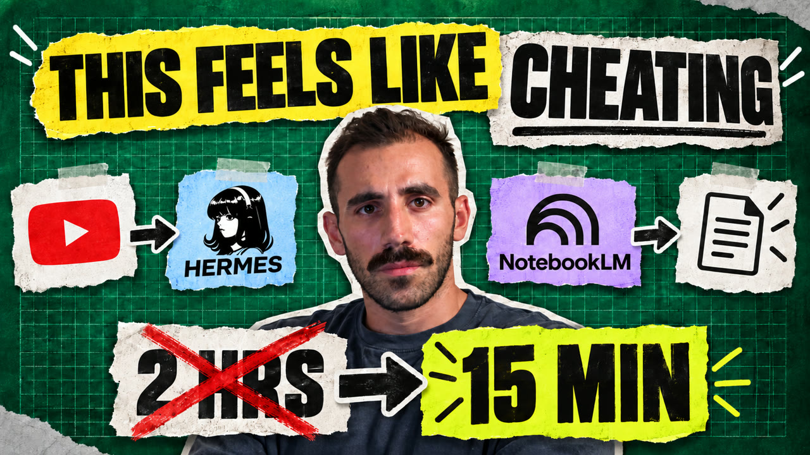

# Hermes Research Agent

**Jev edits my videos now.** A skill for Claude Code (or any coding agent) that takes an OBS
recording to a finished DaVinci Resolve timeline: Whisper transcribes, **Jev** judges which of your
ten takes is the finished one, the script builds the cut, then trims the breaths. One command,
about nine minutes. It is in **[claude/skills/youtube-video](claude/skills/youtube-video/)** —
copy the folder into `~/.claude/skills/`, export `TYPESAFE_API_KEY`, and say "edit this folder".

**▶ Watch:** [Jev Edited This Video](https://youtu.be/RkVIuEzAm7Q) (11 min): the pipeline run live on the video itself.

---

**One shared brain for your AI tools.** Claude Code builds, Hermes runs it while you're away, and both
read the same folder of notes, so you never explain yourself twice. On top of that brain sits a research
worker that watches videos for you.

**▶ Watch:** [I Gave Hermes And Claude Code One Brain](https://youtu.be/az7F75blZQ8) (9 min): the setup, what it costs, and a live demo.

**Fastest way in:** open **[SETUP-WITH-AI.md](SETUP-WITH-AI.md)**, paste the prompt into Claude Code (or Codex, or any
coding agent), and it builds your shared brain with you. By hand, setup takes about 30 minutes.

More builds like this on [my channel](https://www.youtube.com/@heyitspaulb).

## One brain, two agents

**Claude Code builds. Hermes runs it while you're away. Both read the same wiki.**

```
 Claude Code ──reads + writes──►  wiki/  ◄──reads + writes── Hermes
  (CLAUDE.md)                  markdown, git               (AGENTS.md)
                               open it in Obsidian
```

`CLAUDE.md` tells Claude Code to follow `AGENTS.md`, the same rules Hermes reads. Decide something with one
agent, and the other one reads it from the same page next session. No export, no re-explaining, and if a
better tool comes along next year, you point it at the same folder.

There are three kinds of memory in this setup, and only one is shared:

| Layer | Holds | Read by |
|---|---|---|
| **The wiki** | everything true about your business, written on purpose | Claude Code **and** Hermes |
| **Mem0** (optional Hermes plugin) | facts you mention in passing, saved automatically | Hermes |
| **Hermes built-in memory** | how you like to work; two small files, about 3,500 characters | Hermes |

Mem0 setup: `hermes memory setup`, choose mem0, paste a free key from [app.mem0.ai](https://app.mem0.ai).

A worked example of "build once, run daily" is in **[examples/daily-report.md](examples/daily-report.md)**:
a YouTube channel report that Hermes runs every morning with no AI model, so it costs nothing.

```
 you ──► Hermes (main agent) ──hands off──► Argus (worker)
              │                               │  farm.py: transcript → raw/
              │ reads before answering        │  hermes-video-watch: frames → "seen, not heard"
              ▼                               ▼
         wiki/ (LLM wiki)              NotebookLM notebook ◄── you chat with the video
              ▲
 cerberus.sh (no AI) checks every hour that the server, site and wiki sync are healthy
```

## The research worker (videos 1 and 2)

Give Hermes a YouTube link, an Instagram reel, a TikTok, or a video file on your disk, and a
worker agent gets the transcript (or makes one locally when there are no
captions), **watches the frames for what's on screen**, files it into your
knowledge base, and builds a NotebookLM notebook you can chat with.

[](https://youtu.be/frDNPtWofIM)

**▶ Part 1:** [I Stopped Watching YouTube. Now YouTubers Answer My Questions.](https://youtu.be/frDNPtWofIM) (5 min)
**▶ Part 2:** [Chat With Any TikTok, Reel or Video](https://youtu.be/-0IVqyLO2Ik) (4 min): local files, reels and TikToks with no captions

## What you get

| Part | What it does | File |
|---|---|---|
| **Wiki memory** | The agent's knowledge is a folder of markdown pages, one per thing in your business, so it reads a page instead of "remembering" | `AGENTS.md`, `wiki/`, `raw/` |
| **Shared brain** | Claude Code and Hermes follow the same rules and read the same pages | `CLAUDE.md`, `AGENTS.md`, `SETUP-WITH-AI.md` |
| **Daily report example** | A script Hermes runs on a schedule with no model | `tools/youtube-report.py`, `examples/daily-report.md` |
| **Lint gate** | A pre-commit hook that blocks the agent from committing a broken wiki | `tools/lint.py`, `tools/hooks/pre-commit` |
| **Argus, the worker** | One job: turn a video into a source file, including what was on screen, then push it to NotebookLM | `hermes/argus/`, `tools/farm.py`, `tools/whisper-stt.sh`, `hermes/skills/hermes-video-watch/` |
| **YouTube pipeline** | OBS recording → transcript → Jev picks the takes → Resolve timeline → breath trim → thumbnails | `claude/skills/youtube-video/` |
| **Cerberus, the watchdog** | A plain shell script, no model, that messages you once when something breaks | `watchdog/cerberus.sh` |

Everything is text files in git. No vector database, no subscription beyond the
model you already use.

## Before you start

- [Hermes Agent](https://github.com/NousResearch/hermes-agent) installed and connected to a model
- Python 3.10+, `git`, `ffmpeg`
- `yt-dlp` (`brew install yt-dlp`, `pipx install yt-dlp`, or `uv`)
- `whisper.cpp` for videos without captions (reels, TikToks, local files):
  `brew install whisper-cpp`, then download a model, e.g.
  `curl -L -o ~/ggml-large-v3-turbo.bin https://huggingface.co/ggerganov/whisper.cpp/resolve/main/ggml-large-v3-turbo.bin`
  and put `export WHISPER_MODEL=~/ggml-large-v3-turbo.bin` in your shell profile
- A Google account for NotebookLM
- Optional: [Obsidian](https://obsidian.md) to browse the wiki as a graph

**Run Argus on your own computer, not a cloud server.** YouTube blocks most
datacenter IPs ("Sign in to confirm you're not a bot"). A server is fine for
the main agent and the watchdog.

## Setup

### 1. Install Hermes

```bash
curl -fsSL https://hermes-agent.nousresearch.com/install.sh | bash
hermes setup
```

### 2. Clone this repo as your wiki

```bash
git clone https://github.com/paulthewebdeveloper/hermes-research-agent.git ~/hermes-research-agent
cd ~/hermes-research-agent
git config core.hooksPath tools/hooks     # turns on the lint gate
python3 tools/lint.py                     # should print: 0 error(s)
```

Point Hermes at this folder as its working directory (in `~/.hermes/config.yaml`,
the terminal `cwd`), so it reads `AGENTS.md` on every session.

### 3. Make the wiki yours

Open `AGENTS.md` and read it; it's the rules the agent follows. Then:

1. Write down the ten nouns your business runs on (clients, projects, suppliers,
   courses, whatever). Those are your first ten pages in `wiki/pages/`.
2. Delete `wiki/pages/example-client.md`.
3. Add a `wiki/pages/rules.md`: how you want to be worked with, plus the two or
   three mistakes you keep making. The agent will call them out.

The pattern comes from Andrej Karpathy's
[LLM wiki](https://gist.github.com/karpathy/442a6bf555914893e9891c11519de94f).
It's worth reading once.

### 4. Install the video skill

```bash
mkdir -p ~/.hermes/skills/media
ln -s ~/hermes-research-agent/hermes/skills/hermes-video-watch ~/.hermes/skills/media/hermes-video-watch
python3 ~/.hermes/skills/media/hermes-video-watch/scripts/hermes_video_watch.py --help
```

The skill transcribes with whisper.cpp too, through the wrapper in `tools/`. Add
this to your shell profile next to `WHISPER_MODEL`:

```bash
export HERMES_VIDEO_WATCH_STT_COMMAND="$HOME/hermes-research-agent/tools/whisper-stt.sh {audio}"
```

No API key anywhere: captions when they exist, local Whisper when they don't.

### 5. Install the NotebookLM CLI

Uses [notebooklm-mcp-cli](https://github.com/jacob-bd/gemini-notebook-mcp-cli) (MIT).

```bash
uv tool install notebooklm-mcp-cli
nlm login                      # opens a browser, sign in with your Google account
nlm notebook list              # proves it works
```

### 6. Create Argus, the worker

```bash
hermes profile create argus --clone \
  --description "$(sed -n '/^description:/,/^description_auto/p' hermes/argus/profile.yaml | sed '1s/^description: //;$d' | tr '\n' ' ')"

cp hermes/argus/SOUL.md ~/.hermes/profiles/argus/SOUL.md
sed -i.bak "s#<REPO>#$HOME/hermes-research-agent#" ~/.hermes/profiles/argus/SOUL.md
```

Then cut its tools down to the list in `hermes/argus/toolsets.txt`
(web, terminal, file, video, vision, skills, memory):

```bash
HERMES_HOME=~/.hermes/profiles/argus hermes tools list
HERMES_HOME=~/.hermes/profiles/argus hermes tools disable <each tool not in toolsets.txt>
```

**Do this step.** `--clone` copies everything from your main profile:

- every tool (browser, sub-agents, cron, computer use)
- your chat-platform tokens in `.env`
- your main persona

A worker with every tool is a liability. Also open
`~/.hermes/profiles/argus/config.yaml` and `.env`: turn off any messaging
platforms (Telegram and so on) and remove their tokens. A worker never talks
to you directly.

### 7. Try it

Talk to your main Hermes agent:

> Create a NotebookLM notebook about this video: https://www.youtube.com/watch?v=... Use Argus for it.

Or several sources at once, including a file on your disk:

> /path/to/my-old-reel.mp4 instagram.com/reels/... tiktok.com/@.../video/... process all of these videos for me and launch argus to create notebook lms about each

Instagram and TikTok sometimes refuse anonymous downloads. If `farm.py` reports
that, log in to them in Chrome and add `--cookies-from-browser chrome` to the
yt-dlp calls in `tools/farm.py` (or set `HERMES_VIDEO_WATCH_COOKIES="chrome"`
for the video skill).

Hermes hands the job to Argus. Argus writes a file in `raw/data/` with the
transcript plus what it saw on screen, then gives you a notebook link. Open it
and ask the video questions, or generate an audio overview.

You can also run the worker directly:

```bash
hermes -p argus chat --oneshot -q "farm https://www.youtube.com/watch?v=..."
```

More prompts are in `examples/prompts.md`.

### 8. Optional: the watchdog

For a server running Hermes around the clock. Edit the settings at the top of
`watchdog/cerberus.sh` (your site URL, where alerts go), then:

```bash
crontab -e
# 17 * * * * $HOME/hermes-research-agent/watchdog/cerberus.sh --quick
# 30 8 * * * $HOME/hermes-research-agent/watchdog/cerberus.sh
```

It stays silent while everything passes and sends one message per failure,
through `hermes send`. It uses no AI on purpose: a shell script can't
hallucinate a 200. Written for Linux.

## How the pieces behave

- **The agent reads before it answers.** Log tail, then `hot.md`, then the
  index, then the page. It's slower than a chatbot, and right.
- **`raw/` is immutable.** `farm.py` refuses to overwrite a file, and Argus never
  edits one.
- **Argus marks what it saw on screen as *seen, not heard*.** NotebookLM only
  reads transcripts, so Argus's file is a better source than the bare YouTube link.
- **Unknowns stay unknown.** `**[TODO: ...]**` is correct. An invented answer is not.

## Adapt it

The shape stays the same for any business. The inputs change:

- **Worker input:** meeting recordings, client emails, supplier PDFs. One input,
  one file in `raw/`, honest about what it couldn't read.
- **Notebooks:** one per business area.
- **Watchdog:** start with the one URL that makes you money, and add checks
  when something actually breaks.

Build a new worker only after you've done the job by hand three times.

## Credits

- LLM wiki pattern: [Andrej Karpathy](https://gist.github.com/karpathy/442a6bf555914893e9891c11519de94f)
- [Hermes Agent](https://github.com/NousResearch/hermes-agent) by Nous Research
- `hermes-video-watch` (MIT, included), inspired by [bradautomates/claude-video](https://github.com/bradautomates/claude-video)
- [notebooklm-mcp-cli](https://github.com/jacob-bd/gemini-notebook-mcp-cli) by jacob-bd (MIT)

I set up agent systems like this for businesses: [maketheclick.com](https://maketheclick.com)

MIT licensed.
